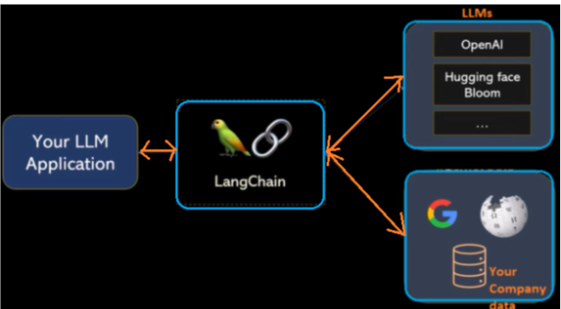
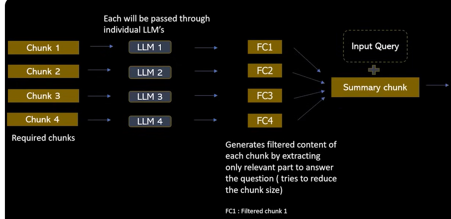

#  **Project Name**        - News-Research-Tool
##### **Domain**              - Finance
##### **Project Type**        - 
##### **Contribution**        - Individual
##### **Tools used**          - 

  - LangChain
  - embedding vector using OpenAI
  - FAISS
  - Streamlit application : 

# Project description :
To built a Bot, easy-to-use news search tool, that makes it simple to retrieve information. To get pertinent insights from the financial and stock market domains. Users can enter the URLs of the articles and can ask queries.

# Features :
  - Load URLs or upload text files containing URLs to fetch article content.
  - Process article content through LangChain's UnstructuredURL Loader
  - Construct an embedding vector using OpenAI's embeddings and leverage FAISS, a powerful similarity search library, to enable swift and effective retrieval of relevant information
  - Interact with the LLM's (Chatgpt) by inputting queries and receiving answers along with source URLs.

# Project Structure :
<br>**Basic structure :**<br>


<br>**Actual workflow :**<br>


# Files created
  - main.py: The main Streamlit application script.
  - vectorEmbedding.pkl: A pickle file to store the FAISS index.
  - .env: Configuration file for storing your OpenAI API key.

# How to use : Example
1. Run the Streamlit app by executing:
   ```sh
   streamlit run main.py
   ```
2.The web app will open in your browser.
- On the sidebar, you can input URLs directly.
- Initiate the data loading and processing by clicking "Process URLs."
- Observe the system as it performs text splitting, generates embedding vectors, and efficiently indexes them using FAISS.
- The embeddings will be stored and indexed using FAISS, enhancing retrieval speed.
- The FAISS index will be saved in a local file path in pickle format for future use.
- One can now ask a question and get the answer based on those news articles


